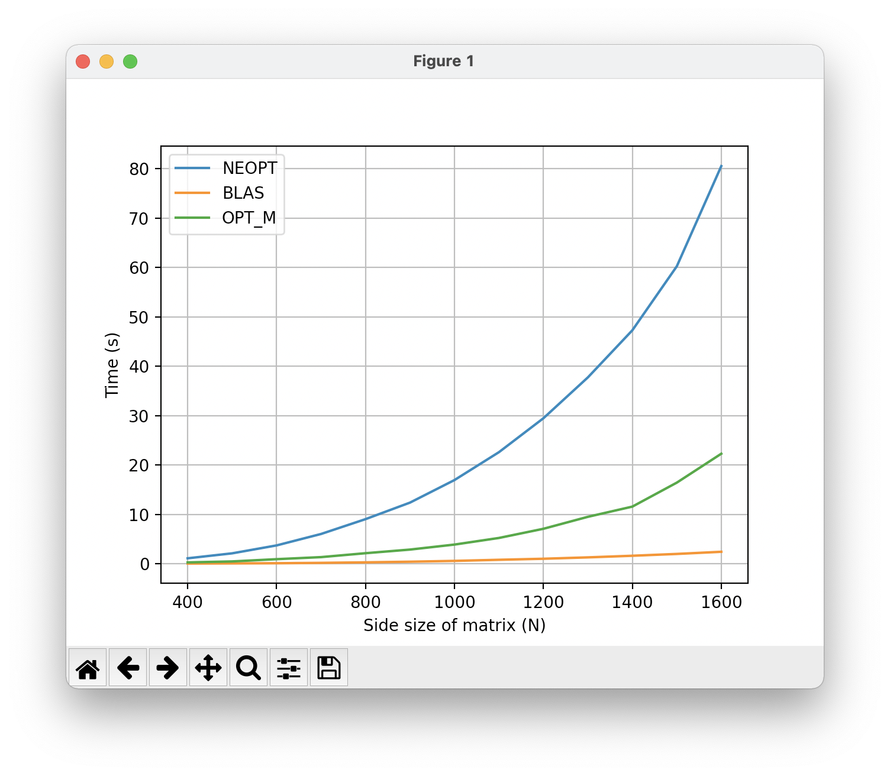

# ASC - Tema 2 - Optimizarea inmultirii matricilor
_Grigore Lucian-Florin 336CA_

Se va folosi simbolul <code>x</code> pentru operatia de inmultire, simbolul <code>+</code> pentru operatia de adunare si <code>t</code> pentru a indica transpusa unei matrici.

## Descrierea cerintei

Se doreste implementarea operatiei: 

<code> C = A x B x Bt + At x A</code>

Pentru toate cele 3 variante implementate si explicate mai jos, ordinea operatiilor a fost aceeasi, si anume:
1. inmultirea <code>A x B</code> si memorarea rezultatului intr-o matrice <code>C</code>
2. inmultirea <code>C x Bt</code> si memorarea rezultatului intr-o matrice <code>D</code>
3. inmultirea <code>At x A</code> si adunarea rezultatului la matricea <code>D</code>

La final matricea <code>D</code> va contine rezultatul operatiei dorite, memoria ocupata pentru matricea <code>C</code> fiind eliberata.

Faptul ca matricea <code>A</code> este superior triunghiulara a dus la urmatoarele modificari, care iau in calcul acest aspect:
* pentru prima inmultire, indicele <code>k</code> merge de la <code>i</code> la <code>N</code>
* pentru cea de a treia inmultire, indicele <code>k</code> merge de la <code>i</code> pana la <code>j</code>(inclusiv)

## Varianta neopt

Pentru implementarea cu nicio optimizare am inmultit matricile in ordinea specificata de mai sus, pastrand indicii de parcurgere a matricilor in ordinea clasica <code>i, j, k</code>. Astfel, se poate observa asemanarea dintre codul scris si formula matematica pe care o implementeaza.

Timpi de rulare obtinuti:
<pre><code>Run=./tema2_neopt: N=400: Time=1.132339
Run=./tema2_neopt: N=500: Time=2.132884
Run=./tema2_neopt: N=600: Time=3.696465
Run=./tema2_neopt: N=700: Time=5.816063
Run=./tema2_neopt: N=800: Time=8.854113
Run=./tema2_neopt: N=900: Time=12.402980
Run=./tema2_neopt: N=1000: Time=16.873104
Run=./tema2_neopt: N=1100: Time=22.628565
Run=./tema2_neopt: N=1200: Time=29.434683
Run=./tema2_neopt: N=1300: Time=37.728886
Run=./tema2_neopt: N=1400: Time=47.248783
Run=./tema2_neopt: N=1500: Time=60.646832
Run=./tema2_neopt: N=1600: Time=79.935295</code></pre>

Ruland <code>valgrind</code> cu <code>cachegrind</code>, am observat ca numarul de miss-uri este mai mare comparativ cu celelalte doua variante.

## Varianta blas

Pentru aceasta rezolvare, am folosit functiile <code>cblas_dtrmm</code> (care ia in calcul ca o matrice este superior triunghiulara) si <code>cblas_dgemm</code>(care inmulteste si/sau aduna 2 sau 3 matrici) astfel:
1. operatia <code>C = A x B</code> cu <code>cblas_dtrmm</code>
2. operatia <code>D = C X Bt</code> cu <code>cblas_dgemm</code>
3. operatia <code>D = D + At x A</code> cu <code>cblas_dgemm</code>

Timpi de rulare obtinuti:
<pre><code>Run=./tema2_blas: N=400: Time=0.070972
Run=./tema2_blas: N=500: Time=0.091494
Run=./tema2_blas: N=600: Time=0.131110
Run=./tema2_blas: N=700: Time=0.206558
Run=./tema2_blas: N=800: Time=0.307480
Run=./tema2_blas: N=900: Time=0.444870
Run=./tema2_blas: N=1000: Time=0.596525
Run=./tema2_blas: N=1100: Time=0.792693
Run=./tema2_blas: N=1200: Time=1.028263
Run=./tema2_blas: N=1300: Time=1.302629
Run=./tema2_blas: N=1400: Time=1.641158
Run=./tema2_blas: N=1500: Time=1.991797
Run=./tema2_blas: N=1600: Time=2.425872</code></pre>

Observam ca timpii de rulare pentru varianta blas sunt impresionant de mici, datorita implementarilor foarte eficiente ale operatiilor din aceasta biblioteca. De asemenea, am observat ca exista mult mai putine <code>refs</code> in urma rularii cu <code>cachegrind</code> comparativ cu varianta <code>neopt</code>.

## Varianta opt_m

La aceasta varianta, am pastrat aceeasi ordine logica a operatiilor ca la cea neoptimizata, dar am realizat urmatoarele modificari de optimizare:
* am eliminat constantele din bucla, prin memorarea cu pointeri a pozitiilor care trebuiau parcurse din fiecare matrice si incrementand acesti pointeri la fiecare pas, in loc de a face operatii precum <code>Matrice[i * N + j]</code> la fiecare iteratie
* am folosit registri pentru a memora acesti pointeri si pentru memorarea sumei calculate, temporar

Timpi de rulare obtinuti:
<pre><code>Run=./tema2_opt_m: N=400: Time=0.298040
Run=./tema2_opt_m: N=500: Time=0.496710
Run=./tema2_opt_m: N=600: Time=1.111103
Run=./tema2_opt_m: N=700: Time=1.676086
Run=./tema2_opt_m: N=800: Time=2.284155
Run=./tema2_opt_m: N=900: Time=2.938754
Run=./tema2_opt_m: N=1000: Time=4.361293
Run=./tema2_opt_m: N=1100: Time=5.485620
Run=./tema2_opt_m: N=1200: Time=7.119803
Run=./tema2_opt_m: N=1300: Time=9.206604
Run=./tema2_opt_m: N=1400: Time=11.659653
Run=./tema2_opt_m: N=1500: Time=15.283806
Run=./tema2_opt_m: N=1600: Time=21.049225</code></pre>

Am observat ca numarul de accesuri la memorie este mult mai mic in aceasta varianta datorita folosirii pointerilor mentionati mai sus, dar numarul de <code>miss-uri</code> a ramas la fel ca la cea neoptimizata.

## Interpretare grafic si concluzii

Ruland script-ul de Python din sursa arhivei cu

<code>python3 performances_graph_plot.py</code>

putem vedea urmatorul grafic:

In acest grafic, se poate observa foarte clar diferenta de performanta (timp de executie) la rularea <code>custom_input</code> pe cele 3 rezolvari. Astfel, putem extrage urmatoarele concluzii:
* varianta <code>opt_m</code> este cu aproape 70% mai eficienta decat cea <code>neopt</code>
* varianta <code>blas</code> este cu mult mai rapida decat orice alta implementare proprie, fiind de aproape 30 de ori mai rapida decat cea <code>opt_m</code>
* chiar si asa, folosirea in codul propriu a doar cateva tehnici de optimizare (neluand in considerare nicio biblioteca precum BLAS) face o diferenta imensa intre <code>neopt</code> si <code>opt_m</code>

## Observatii si precizari

Oricare din cele 3 rezolvari poate fi rulata pe coada <code>ibm-nehalem.q</code> folosind scriptul <code>run.sh</code> astfel:

<code>./run.sh \<nume executabil\></code>

Timpii de rulare inclusi in acest README sunt obtinuti la rularea cu inputul <code>custom_input</code>, care contine 13 teste, cu dimensiuni ale matricilor (N) intre 400 si 1600 (inclusiv), din 100 in 100.

In fisierele <code>.memory</code> se poate vedea ca nu exista leak-uri de memorie, pentru nicio implementare.

In fisierele <code>.cache</code> se poate vedea output-ul comenzii <code>valgrind</code> cu <code>cachegrind</code> pentru fiecare varianta.

In fisierul <code>performances.txt</code> se pot gasi toti timpii de executie pentru cele 3 variante implementate, pentru <code>custom_input</code>.

In fisierul <code>Makefile</code> doar am adaugat libraria <code>libatlas</code>. In rest, nu am modificat alte surse in afara de <code>solver_neopt.c</code>, <code>solver_blas.c</code> si <code>solver_opt.c</code>.

## Bibliografie
https://ocw.cs.pub.ro/courses/asc/teme/tema2

http://www.netlib.org/blas/

https://ocw.cs.pub.ro/courses/asc/laboratoare/05

https://ocw.cs.pub.ro/courses/asc/laboratoare/06
